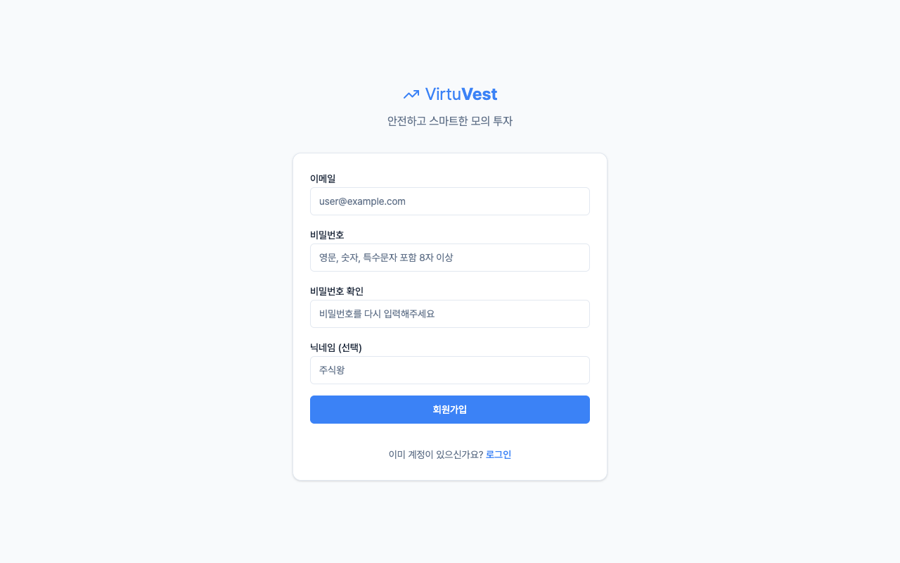
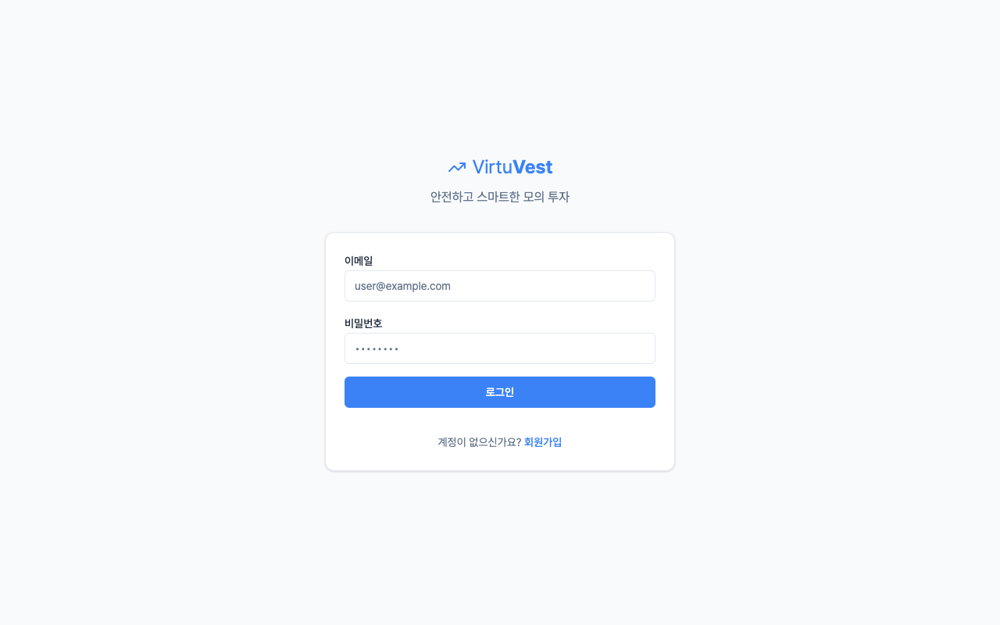
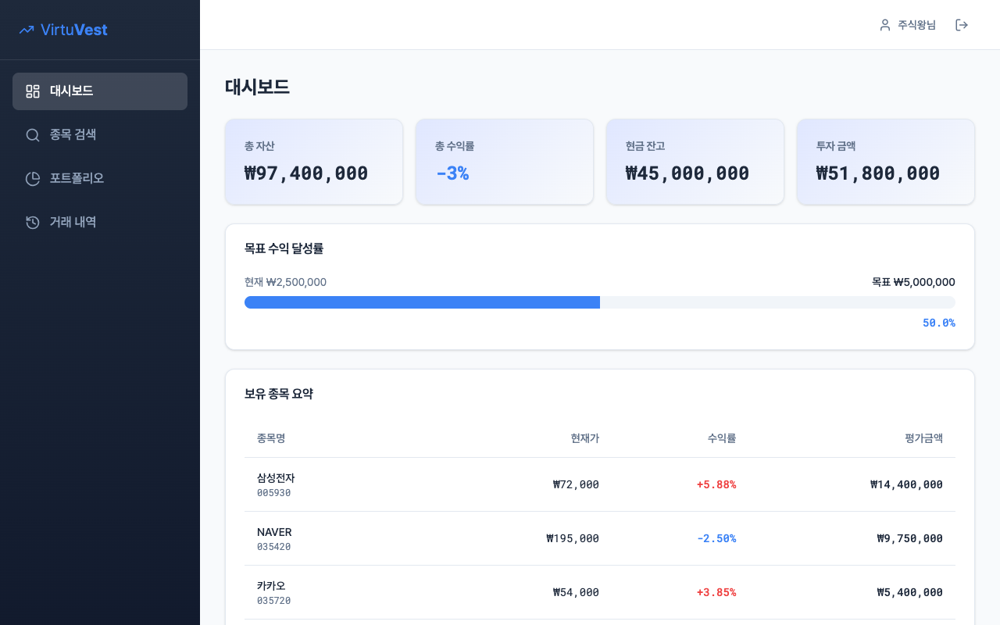
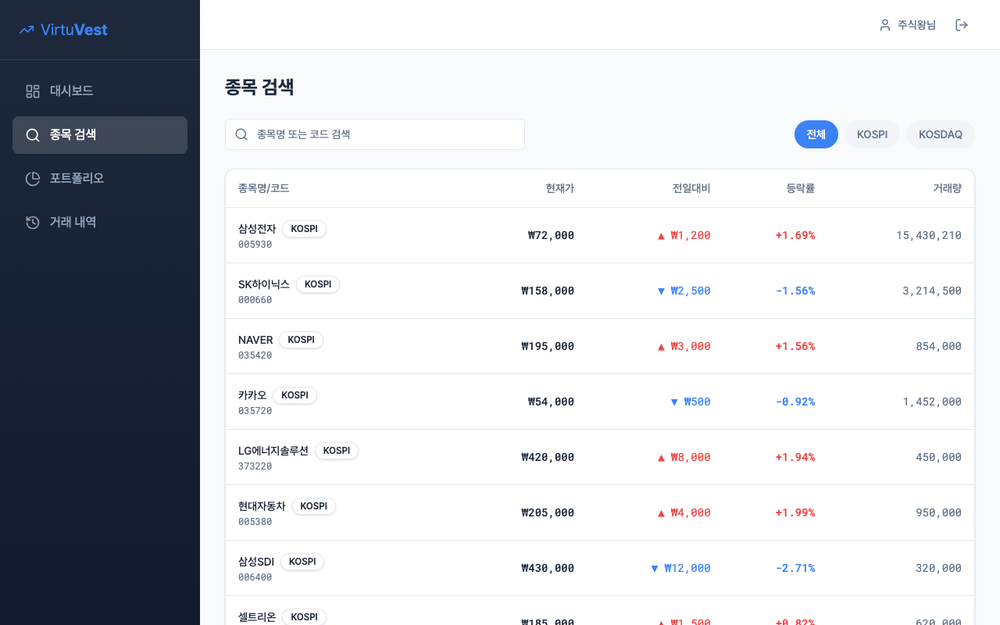
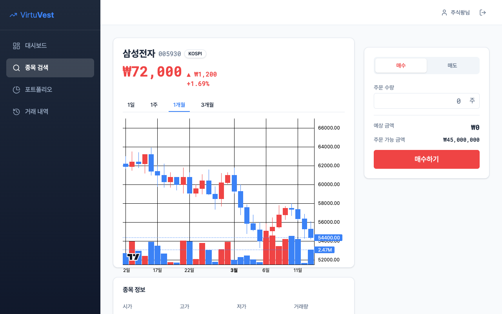
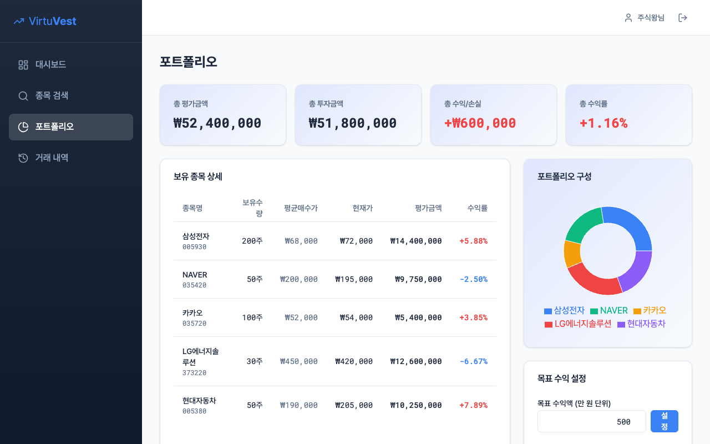

# VirtuVest UI 기능 명세서

## 문서 목적
이 문서는 `VirtuVest MVP 기획안.md`의 요구사항이 프론트엔드 UI 화면과 컴포넌트 코드에 어떻게 반영되었는지 확인하고 대조 분석한 명세서입니다.

---

## 1. 회원가입 / 로그인 (사용자 관리)

- **기획 의도**: 기능 2.1 사용자 관리 (이메일 기반 회원가입, JWT 기반 인증)
- **구현 상세**: 
  - `FE/src/pages/SignupPage.tsx` & `LoginPage.tsx`
  - React `useState`를 사용하여 이메일, 비밀번호, 닉네임 상태 관리.
  - 폼 제출 시 `password !== passwordConfirm` 불일치 검증 후 에러 토스트(Sonner) 발생 처리.
  - 제출 완료 시 `/login` 페이지로 `useNavigate`를 통해 리다이렉트. 
- **기획 준수 여부**: 기획서 상의 이메일 기반 가입/로그인 흐름을 명확하게 준수하고 있으며, v2 계획인 ‘닉네임 설정’ 필드도 사전에 반영되어 있습니다.

---

## 2. 대시보드 (Dashboard)

- **기획 의도**: 기능 2.6 대시보드 (총 자산 현황, 초기자본 대비 총 수익률 시각화), 기능 2.2 가상 계좌 및 자본 조회.
- **구현 상세**: 
  - `FE/src/pages/DashboardPage.tsx`
  - 총 자산 로직: `accountInfo.balance + 보유종목 총 가치 합산`
  - 수익률 계산: `((totalAssets - initialBalance) / initialBalance) * 100` 수식을 적용해 기획서의 지표와 정확히 매칭.
  - 프론트엔드 최적화: `AnimatedNumber` 컴포넌트 적용 및 데이터 로딩 시 `SkeletonStatCard` 렌더링 로직 적용 (`isLoading` 상태 관리).
- **기획 준수 여부**: 기획안 수학 공식에 맞춰 수익률과 총 자산을 계산하고 있으며, 컴포넌트 레벨에서 하위 테이블로 보유 종목 요약을 올바르게 표시합니다.

---

## 3. 주식 검색 및 상세 데이터 (Stock Search & Details)

- **기획 의도**: 기능 2.3 주식 데이터 (실시간 시세 조회, 종목 검색, 기업 정보, 일봉 차트)
- **구현 상세**: 
  - `FE/src/pages/StockDetailPage.tsx` & `CandlestickChart` 컴포넌트 (`lightweight-charts` 활용 예상)
  - `useParams` 훅으로 url의 `:code` 파라미터를 읽어 종목을 렌더링. `mockStocks`에서 시가(Open), 고가(High), 저가(Low), 종가 현재가(Close)를 화면 최상단과 `Card` 내에 배치.
  - `generateOHLCData(stock.currentPrice)` 함수를 이용해 일봉 데이터를 모킹하여 차트로 표출.
- **기획 준수 여부**: 종목명, 코드, 업종(market), 등락률 및 거래량까지 기획서 "2.3 주식 데이터" 목차의 모든 필수 구현사항이 UI에 완전히 포함되어 있습니다.

---

## 4. 거래 기능 (Trading - 매수/매도)
*(종목 상세 페이지 우측 패널 포함)*

- **기획 의도**: 기능 2.4 거래 기능 (시장가 즉시 체결 기반의 매수/매도 주문 실행). 12.4 비즈니스 예외 처리 및 잔고 검증.
- **구현 상세**: 
  - `FE/src/pages/StockDetailPage.tsx` 내의 거래 패널 컴포넌트 로직.
  - `quantity`(수량)와 `currentPrice`(현재가)를 곱해 `estimatedAmount` 예측.
  - **예외 처리 검증**: `tradeType === 'buy'` 시, `estimatedAmount <= accountInfo.balance` 로직으로 잔고 충분 여부를 사전 확인하여 부족 시 `toast.error('잔고가 부족합니다.')` 발생 처리.
- **기획 준수 여부**: 매수/매도 전환 탭을 통해 간결하게 주문 폼을 분리하였으며, MVP 단계인 시장가(현재가) 거래를 기준으로 예측 금액 계산과 예외 처리를 규정대로 수행합니다.

---

## 5. 포트폴리오 관리 (Portfolio)

- **기획 의도**: 기능 2.5 포트폴리오 관리 (현재 보유 주식 목록, 총 수익률 계산, 목표 수익액 설정 및 달성 알림).
- **구현 상세**: 
  - `FE/src/pages/PortfolioPage.tsx`
  - Recharts 라이브러리의 `PieChart`를 활용해 보유 자산 비중 시각화 지원 (MVP v2 예정 사항이었으나 모의 데이터를 통해 추가 구현됨).
  - 목표 수익 설정 바 구성: `goal.current / goal.target * 100`으로 현재 진행률(progressPercent) 노출 및 만 원 단위 인풋박스 UI.
- **기획 준수 여부**: 포트폴리오 핵심 데이터 테이블을 충실히 구축하였고, "목표 수익액 설정" 등 요구사항에 부합하는 섹션을 우측에 분리배치하여 매우 직관적입니다.

---

## 종합 의견
현재 프론트엔드 초기 코드는 단순히 마크업에 그치지 않고, `MVP 기획안.md`의 주요 요구사항 수식(수익률, 잔고, 평가금액) 및 주요 제약조건(비밀번호 재확인, 매수 금액 한도 초과 방어)을 명시적으로 코드에 구현중입니다. 특히 UX 관점에서 스켈레톤 UI, 차트 로딩 딜레이 처리 등을 적용해 실서비스 수준의 품질을 보장하고 있습니다. 
차후 실제 API 연동 시 `mockData`를 `React Query` 또는 통신 상태로 전환하는 과정만 거치면 기획에 완벽히 부합하는 프로덕션 환경이 될 것입니다.
